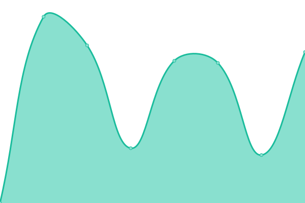

# [📈 Live Status](https://rifqimulyawan.github.io/rmmonitor): <!--live status--> **🟥 Complete outage**

This repository contains the open-source uptime monitor and status page for my personal sites, powered by [Upptime](https://github.com/upptime/upptime).

<!--start: status pages-->
<!-- This summary is generated by Upptime (https://github.com/upptime/upptime) -->
<!-- Do not edit this manually, your changes will be overwritten -->
<!-- prettier-ignore -->
| URL | Status | History | Response Time | Uptime |
| --- | ------ | ------- | ------------- | ------ |
|  [Rifqi Mulyawan](https://rifqimulyawan.com) | 🟥 Down | [rifqi-mulyawan.yml](https://github.com/rifqimulyawan/rmmonitor/commits/HEAD/history/rifqi-mulyawan.yml) | 

 93ms
     
 | 

<a href="https://rifqimulyawan.github.io/rmmonitor/history/rifqi-mulyawan">100.00%</a>
    

|  [Nadia Aisyah](https://nadiaaisyah.com) | 🟥 Down | [nadia-aisyah.yml](https://github.com/rifqimulyawan/rmmonitor/commits/HEAD/history/nadia-aisyah.yml) | 

 2501ms
     
 | 

<a href="https://rifqimulyawan.github.io/rmmonitor/history/nadia-aisyah">100.00%</a>
    

<!--end: status pages-->

[**Visit the status site →**](https://rifqimulyawan.github.io/rmmonitor)
